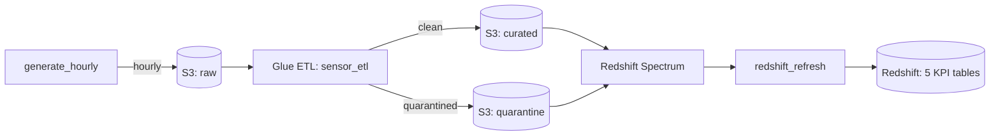
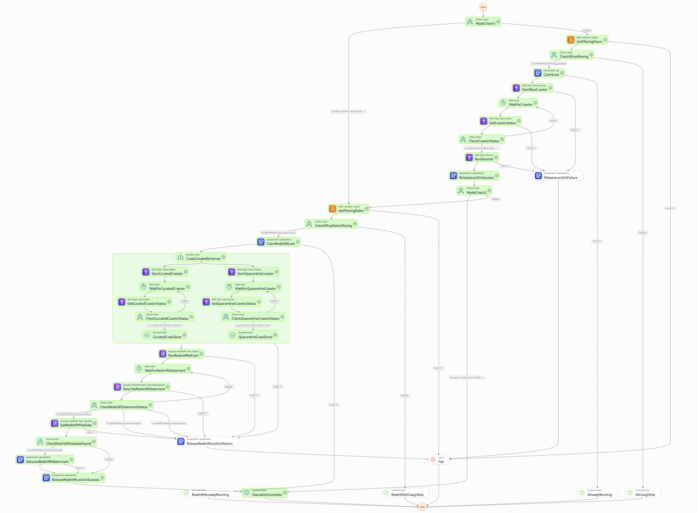

# PulseGrid

A fully automated, self-healing AWS data pipeline simulating mixed-fleet IoT sensor telemetry — from synthetic device data generation through to daily-refreshed business KPIs, with zero manual intervention required at any stage.


## What this is

PulseGrid simulates a fleet of 60 industrial IoT devices (HVAC units, motors, cold storage units, smart meters) across 3 facilities, generating realistic hourly telemetry — including a deliberate ~4% rate of corrupted or malformed data. That data flows through two independently-orchestrated AWS pipelines: one ingests and quality-checks raw readings into a curated data lake, the other aggregates curated data into business-facing KPI tables in Redshift. Both pipelines run entirely on their own, on a schedule, with no human triggering anything.

This project was built to be genuinely production-grade in its engineering discipline — not a toy demo — while remaining a personal, from-scratch build. Full documentation, including the reasoning behind every major design decision, lives in [`docs/`](docs/).

## Architecture



Both stages (`sensor_etl` and `redshift_refresh`) are orchestrated by one combined Step Functions state machine, gated by a `mode` parameter (`full` / `glue_only` / `redshift_only`) and an independent `backfill` mode for manual historical reprocessing. Each stage is protected by its own DynamoDB-backed distributed lock, only ever claimed after confirming there's genuinely new data to process. Full orchestration-control diagram and state-by-state breakdown: [`docs/architecture-flow.md`](docs/architecture-flow.md).



## Notable engineering

- **Self-written, self-verified watermarks.** Neither pipeline trusts what it was *asked* to process — each confirms what it *actually found* before ever advancing its own progress marker.
- **A forward-only regression guard**, enforced entirely inside DynamoDB's own atomic `ConditionExpression` — proven live against a real out-of-order backfill.
- **Locks claimed only when there's real work to do** — both sections check for missing data before ever touching shared state.
- **A genuinely tested Redshift `NULL` edge case**, handled via AWS's own tagged-union response shape rather than a special-cased hack.

Full rationale, trade-offs, and real debugging stories: [`docs/design-choices.md`](docs/design-choices.md).

## Tech stack

| Layer | Tools |
|---|---|
| Orchestration | AWS Step Functions, EventBridge Scheduler |
| Compute | AWS Glue (PySpark), AWS Lambda |
| Storage | S3, Amazon Redshift Serverless (+ Spectrum) |
| Coordination | DynamoDB (distributed locks + watermarks) |
| Infra as Code | Terraform |
| Testing | pytest, moto, freezegun |
| CI | GitHub Actions |

## Repository structure

```
.
├── .github/workflows/      # CI: runs the full test suite on every push/PR
├── data/sample/            # A clean, complete demo day of simulated telemetry
├── docs/                   # Full documentation (this README links to all of it)
│   └── images/
├── glue_jobs/
│   └── etl_job.py           # The sensor_etl PySpark script
├── lambdas/
│   ├── generate_hourly/     # Simulates hourly device telemetry into raw
│   ├── missing_dates/       # Computes redshift_refresh's missing date range
│   └── missing_hours/       # Computes sensor_etl's missing date/hour groups
├── sql/                     # Redshift KPI table refresh queries
├── src/sensor_etl/          # The device simulator + shared config
├── state_machines/
│   └── sensor_etl.asl.json  # The combined Step Functions definition
├── terraform/                # All infrastructure
├── tests/                    # pytest suite (moto + freezegun)
├── pyproject.toml
└── README.md
```

## Running it yourself

**Deploying to your own AWS account requires a few one-time changes first — bucket names, credentials, a manual database user — all covered precisely in [`docs/setup.md`](docs/setup.md). Start there before running the commands below.**

```bash
cd terraform
terraform init
terraform plan
terraform apply
```

Both EventBridge schedules deploy already `ENABLED` — the pipeline starts running on its own schedule the moment `terraform apply` completes. See [`docs/setup.md`](docs/setup.md) if you'd rather disable them first and trigger manually instead:

```bash
aws stepfunctions start-execution \
  --state-machine-arn <state-machine-arn-from-terraform-output> \
  --input file://execution-input.json
```

where `execution-input.json` contains:

```json
{"mode": "full"}
```

Then watch it run in the Step Functions console — the graph view updates live. Full operational detail (backfills, checking watermark state, interpreting a failed run): [`docs/run-project-end-to-end.md`](docs/run-project-end-to-end.md).

## Testing

```bash
pip install -e ".[dev]"
pytest tests/ -v
```

21 tests covering the 3 Lambdas most in need of unit coverage, using `moto` for AWS mocking and `freezegun` for deterministic time-dependent assertions. Runs automatically via GitHub Actions on every push and pull request. `etl_job.py`'s core logic was instead verified through extensive real-execution testing, documented in [`docs/design-choices.md`](docs/design-choices.md).

## Documentation

| Doc | Covers |
|---|---|
| [`docs/architecture.md`](docs/architecture.md) | Every AWS component, its role, and the data model |
| [`docs/architecture-flow.md`](docs/architecture-flow.md) | Orchestration-control diagram + state-by-state walkthrough |
| [`docs/end-to-end-flow.md`](docs/end-to-end-flow.md) | The narrative journey of one sensor reading |
| [`docs/design-choices.md`](docs/design-choices.md) | Why things are built this way, known limitations, real debugging stories |
| [`docs/setup.md`](docs/setup.md) | One-time deployment, including fork-specific changes required |
| [`docs/run-project-end-to-end.md`](docs/run-project-end-to-end.md) | Day-to-day operation |