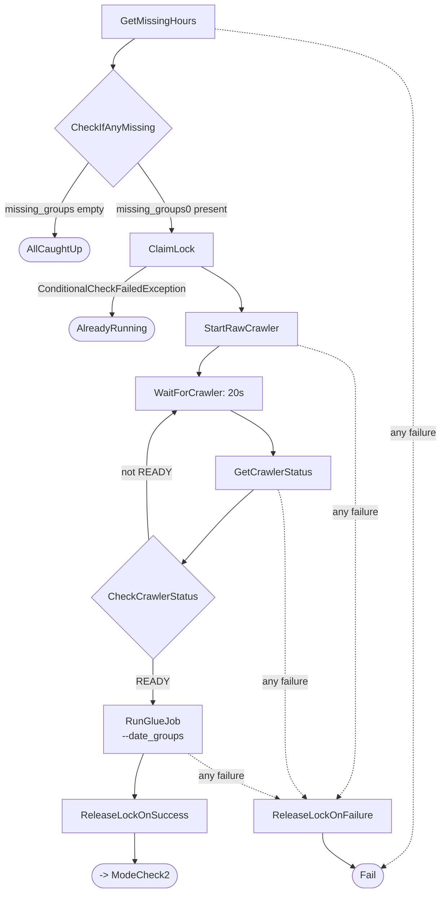
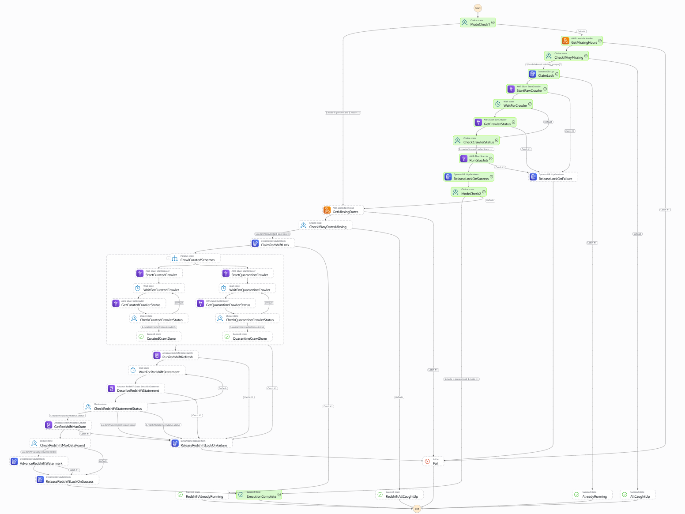
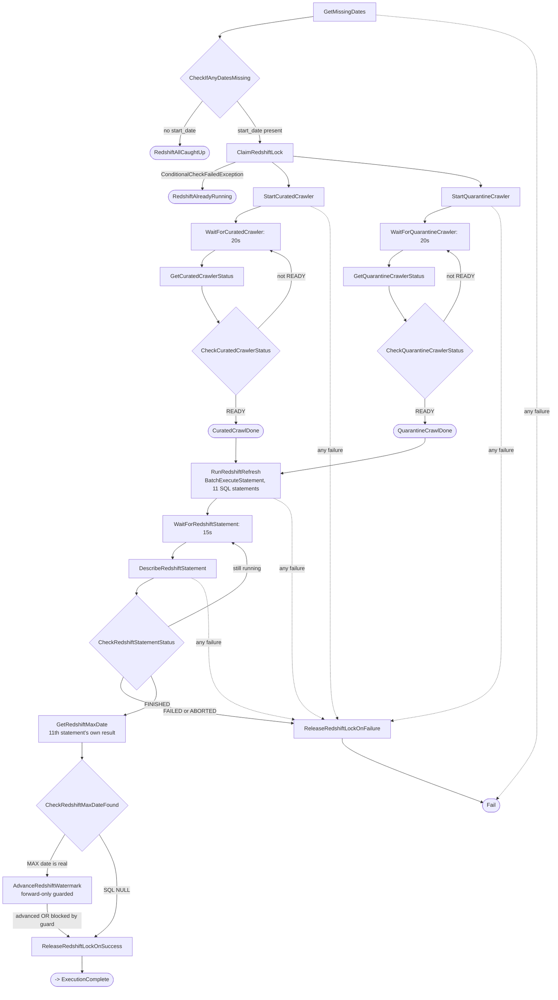
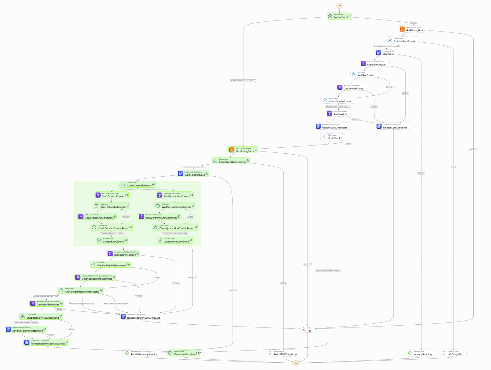

# Architecture Flow

The complete, state-by-state orchestration logic — every real state in `state_machines/sensor_etl.asl.json`, exactly as it exists in the deployed state machine. For the underlying data flow and component roles, see [`architecture.md`](architecture.md); for *why* things are built this way, see [`design-choices.md`](design-choices.md).

31 top-level states in total (38 including the `Parallel` state's own internal branches).

## The `mode` parameter

Every execution starts by evaluating `mode`, an optional field in the execution input:

| `mode` value | What runs |
|---|---|
| `"full"` (or **absent** — this is the real EventBridge trigger's shape) | Both sections, chained in one execution: `sensor_etl` first, then `redshift_refresh` |
| `"glue_only"` | Only `sensor_etl` — ends right after its lock releases |
| `"redshift_only"` | Only `redshift_refresh` — skips `sensor_etl` entirely from the very first state |

Both mode-check states use `And[mode IsPresent, mode==X]`, not a bare string comparison — a `Choice` state's `StringEquals` throws an uncatchable error if the field doesn't exist at all, which is exactly the shape of the real scheduler's trigger. This was a real bug caught via testing, not a defensive habit from the start.

## The `backfill` parameter

Orthogonal to `mode` — a top-level sibling field, not nested inside it:

```json
{"mode": "full", "backfill": {"start_date": "2026-08-24", "end_date": "2026-08-25"}}
```

Both `GetMissingHours` and `GetMissingDates` check for `backfill` first, before touching DynamoDB at all. When present, it bypasses the watermark-driven calendar math entirely and returns exactly the requested range — but the *same* forward-only guard downstream still decides whether either watermark actually advances, independent of what was requested. Two validation checks run before anything else: a reversed range (`end_date` before `start_date`) is rejected immediately, and any range spanning more than 90 days is rejected as a likely typo — both raise a clear error rather than silently proceeding.

## Top-level flow


## `sensor_etl` section — full detail




*A real `mode=glue_only` execution — confirmed via the execution's own recorded input, not inferred from the graph.*

Notes on specific states:
- **`GetMissingHours`'s own failure** routes straight to `Fail`, never through `ReleaseLockOnFailure` — at that point in the flow, no lock has been claimed yet, so there's nothing to release. This is the same principle behind claiming the lock only once real work is confirmed, applied consistently to failure handling too.
- **`ClaimLock`'s catch is deliberately narrow** — only `DynamoDB.ConditionalCheckFailedException`, not `States.ALL` like every other catch in this section. A genuine lock conflict routes to `AlreadyRunning`; any other failure at this state propagates unhandled, since a failed claim means nothing was ever actually acquired to release.
- **`RunGlueJob`** carries its own `Retry` for `Glue.ConcurrentRunsExceededException` (3 attempts, 60s interval, 2.0 backoff) — a real, tested resilience mechanism for the case where a previous execution's Glue job is still finishing as a new one starts.
- **`RunGlueJob`** passes the *whole* `missing_groups` array as one `--date_groups` argument — one Spark session handles every date in the batch, not one job run per date.
- **`ReleaseLockOnFailure`** is reachable from three different states' `Catch` blocks, all converging on the same release-then-fail path — a lock is never left stuck regardless of which specific state fails.

## `redshift_refresh` section — full detail




*A real `mode=redshift_only` execution, including a genuine `AdvanceRedshiftWatermark` run — confirmed via the execution's own recorded input.*

Notes on specific states:
- **`CrawlCuratedSchemas`** is this project's only `Parallel` state, shown here fully expanded — both crawlers run concurrently, not sequentially, since they target independent S3 prefixes with no data dependency between them. `RunRedshiftRefresh` only proceeds once *both* branches have completed.
- **`RunRedshiftRefresh`** submits 11 statements in one `TRANSACTION`-mode batch: 5 `DELETE`+`INSERT` pairs for the KPI tables, plus an 11th, read-only `SELECT MAX(dt)` — the mechanism the next two states use to verify what was *actually* found, not what was requested.
- **`GetRedshiftMaxDate`** reads the 11th statement's own sub-result via `SubStatements[10].Id` — `BatchExecuteStatement`'s parent ID can't retrieve results directly; each statement in the batch gets its own sub-statement ID.
- **`CheckRedshiftMaxDateFound`** exists because `MAX(dt)` over zero matched rows returns SQL `NULL`, represented as `{"IsNull": true}` rather than an empty `StringValue` — checking for the key's presence correctly distinguishes a real date from this case.
- **`AdvanceRedshiftWatermark`**'s `Catch` deliberately routes to `ReleaseRedshiftLockOnSuccess`, not `...OnFailure` — a regression-guard block (`ConditionalCheckFailedException`) is expected, correct behavior, never treated as a pipeline failure.

## Poll-loop pattern, used three times

The raw crawler, each of the two crawlers inside `CrawlCuratedSchemas`, and the Redshift statement check all use the identical shape: `Wait` → check status → `Choice` routing back to the same `Wait` state if not yet done. The Redshift version adds explicit `FAILED`/`ABORTED` branches — without them, a genuinely failed statement would loop on `Wait` forever, since only checking for the success status and treating everything else as "still running" doesn't account for terminal failure states.

## Lock release is always unconditional, on every path

Every route to `Fail` — in both sections — passes through a release state first (`ReleaseLockOnFailure` / `ReleaseRedshiftLockOnFailure`), *except* when the failure happens before any lock was ever claimed (`GetMissingHours`/`GetMissingDates`'s own failures, which route straight to `Fail`). Both release states also carry their own `Retry` block, specifically so a transient failure in the *release call itself* can't leave a lock permanently stuck — the one failure mode that would otherwise block every future execution indefinitely.