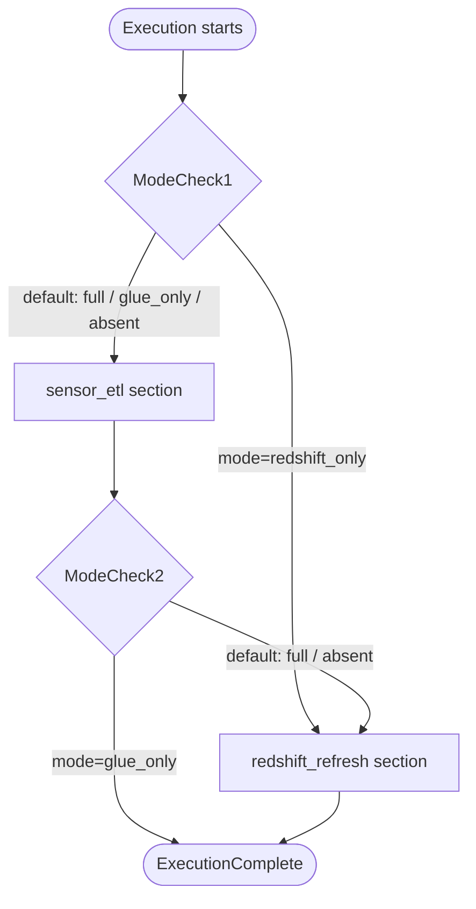
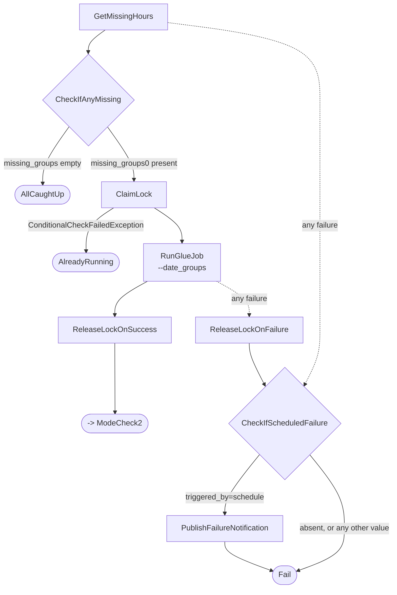
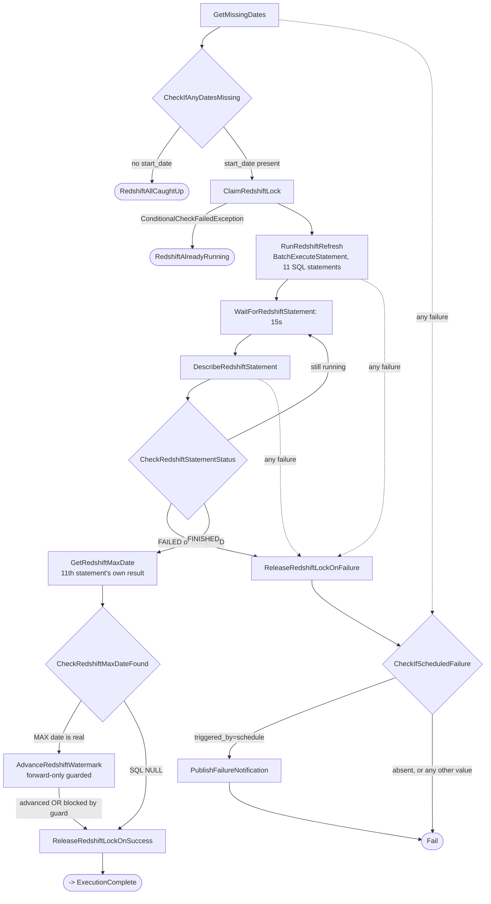

# Architecture Flow

The complete, state-by-state orchestration logic — every real state in `state_machines/sensor_etl.asl.json`, exactly as it exists in the deployed state machine. For the underlying data flow and component roles, see [`architecture.md`](architecture.md); for *why* things are built this way, see [`design-choices.md`](design-choices.md).

28 states in total — no `Parallel` state remains in this definition, so this is also the complete count including branches.

## The `mode` parameter

Every execution starts by evaluating `mode`, an optional field in the execution input:

| `mode` value | What runs |
|---|---|
| `"full"` (or **absent** — this is the real EventBridge trigger's shape) | Both sections, chained in one execution: `sensor_etl` first, then `redshift_refresh` |
| `"glue_only"` | Only `sensor_etl` — ends right after its lock releases |
| `"redshift_only"` | Only `redshift_refresh` — skips `sensor_etl` entirely from the very first state |

Both mode-check states use `And[mode IsPresent, mode==X]`, not a bare string comparison — a `Choice` state's `StringEquals` throws an uncatchable error if the field doesn't exist at all, which is exactly the shape of the real scheduler's trigger. This was a real bug caught via testing, not a defensive habit from the start. The same pattern is reused for `triggered_by`, below.

## The `backfill` parameter

Orthogonal to `mode` — a top-level sibling field, not nested inside it:

```json
{"mode": "full", "backfill": {"start_date": "2026-08-24", "end_date": "2026-08-25"}}
```

Both `GetMissingHours` and `GetMissingDates` check for `backfill` first, before touching DynamoDB at all. When present, it bypasses the watermark-driven calendar math entirely and returns exactly the requested range — but the *same* forward-only guard downstream still decides whether either watermark actually advances, independent of what was requested. Two validation checks run before anything else: a reversed range (`end_date` before `start_date`) is rejected immediately, and any range spanning more than 90 days is rejected as a likely typo — both raise a clear error rather than silently proceeding.

## The `triggered_by` parameter

Also a top-level, optional field — but unlike `mode`/`backfill`, it's never read while an execution is doing real work. It's checked exactly once, only if an execution *fails*, to decide whether the failure is worth emailing about:

```json
{"mode": "full", "triggered_by": "schedule"}
```

Only the real EventBridge daily trigger sends this — confirmed directly against the live resource:
```bash
aws scheduler get-schedule --name pulsegrid-dev-sensor-etl-daily --query "Target.Input" --output text
# {"mode":"full","triggered_by":"schedule"}
```

A manually-started execution (console or CLI) never includes it, so a manual test's failure stays silent by default — the same `And[IsPresent, StringEquals]` pattern as `ModeCheck1`/`ModeCheck2` decides this. Full mechanism, design rationale, and a real example: see [Failure notifications](#failure-notifications) below.

## Top-level flow



## `sensor_etl` section — full detail

Neither section calls a crawler as part of its automatic flow. `sensor_etl`'s own raw crawler resource still exists, but only for manual backfills done by uploading files directly to S3 — routine hourly data self-registers its own partition via `generate_hourly`, and `ClaimLock` here routes straight to `RunGlueJob`, never touching the crawler at all.




Notes on specific states:
- **`GetMissingHours`'s own failure** routes to `CheckIfScheduledFailure` directly, never through `ReleaseLockOnFailure` — at that point in the flow, no lock has been claimed yet, so there's nothing to release. This is the same principle behind claiming the lock only once real work is confirmed, applied consistently to failure handling too.
- **`ClaimLock`'s catch is deliberately narrow** — only `DynamoDB.ConditionalCheckFailedException`, not `States.ALL` like every other catch in this section. A genuine lock conflict routes to `AlreadyRunning`; any other failure at this state propagates unhandled, since a failed claim means nothing was ever actually acquired to release.
- **`RunGlueJob`** carries its own `Retry` for `Glue.ConcurrentRunsExceededException` (3 attempts, 60s interval, 2.0 backoff) — a real, tested resilience mechanism for the case where a previous execution's Glue job is still finishing as a new one starts.
- **`RunGlueJob`** passes the *whole* `missing_groups` array as one `--date_groups` argument — one Spark session handles every date in the batch, not one job run per date. It's also now the state directly responsible for registering every partition it writes — see [`architecture.md`](architecture.md#curated-quarantine-and-pipeline_runs---partition-registration) and [`design-choices.md`](design-choices.md) for the full story of why.
- **`CheckIfScheduledFailure`** is a single, shared gate — reached from both this section's failures *and* `redshift_refresh`'s (below).

## `redshift_refresh` section — full detail




Notes on specific states:
- **`ClaimRedshiftLock` routes straight to `RunRedshiftRefresh`** — no crawler step at all. `curated`, `quarantine_sensor_readings`, and `pipeline_runs` are all now partition-registered directly by `etl_job.py`, not discovered by a crawler that ran here. This project's only `Parallel` state (the curated + quarantine crawler pair) has been removed entirely — see [`design-choices.md`](design-choices.md) for why crawling was needed in the first place, and why it was replaced with direct registration rather than partition projection.
- **`GetMissingDates`' `ResultSelector` deliberately defers extraction**, carrying the whole `Payload` object forward (`"Payload.$": "$.Payload"`) instead of immediately pulling out `start_date`/`end_date`. This was a real bug fix: `missing_dates`' own "nothing to do" case returns a genuinely empty `{}`, and extracting fields immediately crashed with an uncatchable `States.Runtime` error the first time this ran live against a truly empty response. `CheckIfAnyDatesMissing` and `RunRedshiftRefresh` both read from the resulting `$.redshiftResult.Payload.*` path, one level deeper than before, for the same reason.
- **`RunRedshiftRefresh`** submits 11 statements in one `TRANSACTION`-mode batch: 5 `DELETE`+`INSERT` pairs for the KPI tables, plus an 11th, read-only `SELECT MAX(dt)` — the mechanism the next two states use to verify what was *actually* found, not what was requested.
- **`GetRedshiftMaxDate`** reads the 11th statement's own sub-result via `SubStatements[10].Id` — `BatchExecuteStatement`'s parent ID can't retrieve results directly; each statement in the batch gets its own sub-statement ID.
- **`CheckRedshiftMaxDateFound`** exists because `MAX(dt)` over zero matched rows returns SQL `NULL`, represented as `{"IsNull": true}` rather than an empty `StringValue` — checking for the key's presence correctly distinguishes a real date from this case.
- **`AdvanceRedshiftWatermark`**'s `Catch` deliberately routes to `ReleaseRedshiftLockOnSuccess`, not `...OnFailure` — a regression-guard block (`ConditionalCheckFailedException`) is expected, correct behavior, never treated as a pipeline failure.
- **`CheckIfScheduledFailure`/`PublishFailureNotification`** here (labeled `CSF2`/`PFN2` in the diagram above purely to avoid a naming clash within this one Mermaid code block) are the **same shared states** shown in the `sensor_etl` section's diagram — not a second copy. Both sections' failures converge on one gate.

## Poll-loop pattern

Only one remains in this definition: the Redshift statement check (`WaitForRedshiftStatement` → `DescribeRedshiftStatement` → `CheckRedshiftStatementStatus`, routing back to the same `Wait` state if not yet done). It adds explicit `FAILED`/`ABORTED` branches — without them, a genuinely failed statement would loop on `Wait` forever, since only checking for the success status and treating everything else as "still running" doesn't account for terminal failure states. Two other, near-identical poll loops (the raw crawler, and each of the curated/quarantine crawlers) existed earlier in this project but have since been removed along with the crawlers themselves.

## Failure notifications

Every failure route in both sections converges on one shared gate, `CheckIfScheduledFailure` (see [the `triggered_by` parameter](#the-triggered_by-parameter) above for the input field itself). This section covers the mechanism's internal design.

**Why the notification message dumps the whole state via `States.JsonToString($)`, instead of referencing `$.error` directly:** `$.error` isn't guaranteed present on every path reaching this gate. `CheckRedshiftStatementStatus`'s `FAILED`/`ABORTED` branches route straight to `ReleaseRedshiftLockOnFailure` without ever passing through a `Catch` block — meaning no `$.error` gets populated in that specific case. Referencing an absent field directly would trip the exact same uncatchable-error class the `IsPresent` guards elsewhere in this file exist to prevent. Dumping the entire state sidesteps the question of what's present and gives strictly more debugging context, not less.

A real example, from actual testing — a deliberately reversed `backfill` range, triggered with `triggered_by=schedule`:

```
Subject: PulseGrid pipeline failure

PulseGrid scheduled execution failed.

Execution: d8812599-a4d8-49b3-a66c-592df6604fe3

Full state at failure:
{"mode":"glue_only","triggered_by":"schedule","backfill":{"start_date":"2026-06-05","end_date":"2026-06-01"},"error":{"Error":"ValueError","Cause":"{\"errorMessage\":\"backfill end_date (2026-06-01) is before start_date (2026-06-05)\",\"errorType\":\"ValueError\", ...}}
```

The identical failure triggered without `triggered_by` produces no email at all — confirmed via the same test, run twice.

## Lock release is always unconditional, on every path

Every failure — in both sections — passes through a release state first (`ReleaseLockOnFailure` / `ReleaseRedshiftLockOnFailure`), *except* when the failure happens before any lock was ever claimed (`GetMissingHours`/`GetMissingDates`'s own failures, which route straight to `CheckIfScheduledFailure`). Both release states also carry their own `Retry` block, specifically so a transient failure in the *release call itself* can't leave a lock permanently stuck.

The notification gate sits strictly *after* both release states — never before, never instead of them. This is what makes the notification feature safe by construction: even a mistake in its own logic can't reintroduce a stuck lock, because by the time any execution reaches `CheckIfScheduledFailure`, its lock (if it ever held one) has already been safely released.