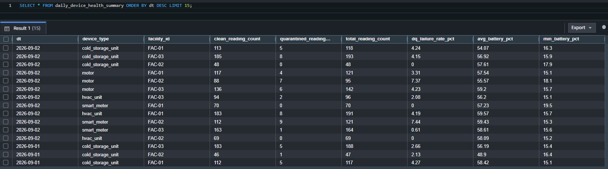
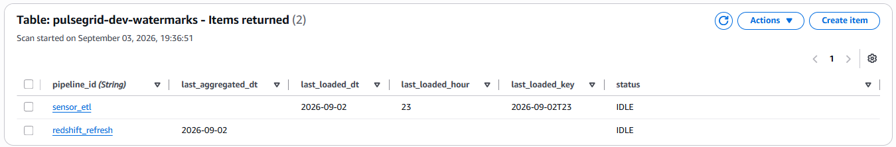

# Architecture

The complete inventory of every AWS component in PulseGrid, what it does, and how data is actually shaped as it moves through the system. For *how* these components are orchestrated together (the state-machine control flow), see [`architecture-flow.md`](architecture-flow.md).

## Component inventory

### Storage

| Component | Role |
|---|---|
| S3 `raw` bucket | Hourly device telemetry, written directly by `generate_hourly`. Partitioned `dt=YYYY-MM-DD/hour=HH/`. |
| S3 `curated` bucket | Clean readings (Parquet), quarantined readings (JSON), and per-run audit records — all written by the Glue ETL job. |
| S3 `glue-assets` bucket | Holds the Glue job's own script and its Spark temp directory. |

### Compute

| Component | Role |
|---|---|
| Glue ETL job (`sensor_etl`) | PySpark script: reads raw via a combined multi-date predicate, applies the DQ gate, splits clean/quarantined, writes both, self-verifies and advances its own watermark. |
| Glue crawler — raw | Catalogs `raw` so the ETL job's `push_down_predicate` can resolve partitions. Re-run automatically at the start of every `sensor_etl` execution. |
| Glue crawler — curated | Catalogs `curated/sensor_readings/` for Spectrum. Re-run automatically (in parallel with the quarantine crawler) at the start of every `redshift_refresh` execution. |
| Glue crawler — curated-quarantine | Catalogs `curated/quarantine/sensor_readings/` for Spectrum. Same re-run trigger as above. |
| Lambda `missing_hours` | Computes `sensor_etl`'s missing date/hour groups, comparing its own watermark against real elapsed time. Also handles `backfill` requests. |
| Lambda `missing_dates` | Computes `redshift_refresh`'s missing date range, cross-referencing `sensor_etl`'s watermark to avoid aggregating a day that isn't fully loaded yet. Also handles `backfill`. |
| Lambda `generate_hourly` | Simulates one hour of device telemetry (reusing `sensor_etl.generate`'s real fleet/generation logic) and writes it directly to `raw`. |

### Data warehouse

| Component | Role |
|---|---|
| Redshift Serverless (namespace + workgroup) | Hosts the 5 native KPI tables. |
| Redshift Spectrum external schema (`curated_spectrum`) | Reads `curated`'s Parquet/JSON directly from S3 without a load step — the bridge between the data lake and the warehouse. |
| `redshift_refresh` (Redshift Data API + SQL) | `DELETE`+`INSERT` refresh of all 5 KPI tables over a date range, run as one transactional batch, verified via a real `MAX(dt)` query before advancing its own watermark. |

### Orchestration

| Component | Role |
|---|---|
| Step Functions state machine | One combined definition covering both `sensor_etl` and `redshift_refresh`, gated by a `mode` parameter and an independent `backfill` parameter. Every failure path converges on a shared gate that emails a failure notification, but only for the real scheduled trigger — see [`architecture-flow.md`](architecture-flow.md#failure-notifications). |
| EventBridge Scheduler — `generate_hourly` | Fires hourly, on the hour (`cron(0 * * * ? *)`, UTC). |
| EventBridge Scheduler — `sensor_etl_daily` | Fires daily at `00:30 UTC` — 30 minutes after `generate_hourly`'s midnight run closes out the previous day, so a full day is always ready. Drives the *entire* combined state machine (both pipeline sections) via `mode=full`. |

### Coordination

| Component | Role |
|---|---|
| DynamoDB table `watermarks` | One table, two items — `sensor_etl`'s and `redshift_refresh`'s independent progress markers, plus each pipeline's distributed lock `status`. |

### Security & credentials

| Component | Role |
|---|---|
| Secrets Manager secret | Holds `redshift_refresh_svc`'s database credentials for the Redshift Data API. |
| SNS topic | One topic, one email subscription, for pipeline failure notifications. Requires a one-time manual confirmation click after deployment — see [`setup.md`](setup.md). |
| IAM roles (one per component) | Every Lambda, the Glue job, and the state machine's own execution role each get a distinct, narrowly-scoped role — see [Security model](#security-model) below. |

### Analytics (verification tool, not part of the live pipeline)

| Component | Role |
|---|---|
| Athena workgroup | Used during development to verify Glue Catalog partition pruning. Not invoked by any automated schedule. |

## Data model

### `raw` — one line per device reading

```
s3://pulsegrid-dev-raw/
  dt=YYYY-MM-DD/
    hour=HH/
      batch_YYYYMMDDTHHMMSS.jsonl
```

Each line is one JSON record. Common fields: `device_id`, `device_type`, `facility_id`, `zone`, `firmware_version`, `status`, `timestamp`, `battery_pct`. Device-type-specific fields vary — e.g. `hvac_unit` carries `temperature_c`/`humidity_pct`; `motor` carries `vibration_mm_s`/`rpm`; `cold_storage_unit` carries `temperature_c`/`door_open_count`; `smart_meter` carries `energy_kwh`/`voltage`.

### `curated` — the ETL job's output

```
s3://pulsegrid-dev-curated/
  sensor_readings/
    dt=.../hour=.../*.parquet        <- clean records
  quarantine/
    sensor_readings/
      dt=.../hour=.../*.json         <- quarantined records
  audit/
    pipeline_runs/
      dt=.../run_<job_run_id>.json   <- see below
```

### `curated/audit/pipeline_runs` — self-reported run records

Written directly by `etl_job.py` on every successful run, one JSON file per date actually confirmed processed:

```json
{
  "run_id": "jr_2eaec6eff8926ab827033005674485cb4b21c1cea2071b240e4ab83e3ba5d788",
  "run_timestamp": "2026-09-01T15:42:29.458375+00:00",
  "target_date": "2026-08-31",
  "hours_processed": "11,12,13,14,15,16,17,18,19,20,21,22,23",
  "status": "SUCCESS",
  "started_at": "2026-09-01T15:42:29.458413+00:00",
  "completed_at": "2026-09-01T15:43:20.646184+00:00",
  "duration_seconds": 51.2,
  "records_clean": 0,
  "records_quarantined": 0
}
```

Two deliberate rules shape what gets written, not just when: a date only receives a record if it falls at or before the date/hour the job's own watermark actually advanced to that run — a requested-but-unconfirmed date gets no record at all, not even a zero-count one. And a run that finds genuinely nothing anywhere writes **zero** audit records — not one explaining the emptiness. Full reasoning for both choices: [`design-choices.md`](design-choices.md).

### Redshift — 5 KPI tables

All `DISTSTYLE ALL`, `SORTKEY(dt)`.

| Table | Grain | Key columns |
|---|---|---|
| `daily_device_health_summary` | dt × device_type × facility | `clean_reading_count`, `quarantined_reading_count`, `dq_failure_rate_pct`, `avg_battery_pct`, `min_battery_pct` |
| `daily_motor_vibration_trend` | dt × device_id | `avg_vibration_mm_s`, `max_vibration_mm_s` |
| `daily_cold_storage_risk` | dt × device_id | `avg_temperature_c`, `door_open_count` |
| `daily_hvac_stability` | dt × device_id × zone | `avg_temperature_c`, `stddev_temperature_c` |
| `daily_energy_voltage_summary` | dt × device_id | `total_energy_kwh`, `avg_voltage`, `min_voltage` |



### DynamoDB `watermarks` — the coordination table

Single table, `pipeline_id` as partition key. Two items exist, one per pipeline:

```json
{"pipeline_id": "sensor_etl", "status": "IDLE", "last_loaded_dt": "2026-09-01", "last_loaded_hour": "23", "last_loaded_key": "2026-09-01T23"}
{"pipeline_id": "redshift_refresh", "status": "IDLE", "last_aggregated_dt": "2026-08-30"}
```

`status` is the distributed lock (`IDLE`/`RUNNING`), atomically guarded via a `ConditionExpression` on claim. `last_loaded_key` (a combined `dt`+`hour` string) exists specifically so `sensor_etl`'s forward-only guard can do a single-field comparison; `redshift_refresh` needs no equivalent, since a plain date string already sorts correctly on its own.



## Security model

Every component gets its **own** IAM role, scoped to exactly what it needs — never a shared or broad role. A few concrete examples: `generate_hourly`'s role has `s3:PutObject` on `raw` only — no read, list, or delete. `missing_dates`' role has `dynamodb:GetItem` only — it never writes. The Glue job's role has `dynamodb:UpdateItem` scoped to the one watermarks table, nothing broader. The state machine's own execution role has `sns:Publish` scoped to exactly the one failure-notification topic — nothing broader, and it's a distinct grant from the *deploy user's* own SNS permissions (topic creation, subscription management), which exist only to let Terraform provision the topic in the first place, never to publish to it. This pattern holds throughout — no component can do more than its own specific job requires.