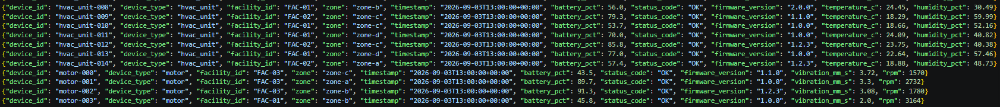

# End-to-End Flow

A narrative walkthrough of what actually happens to a single sensor reading, from the moment it's generated to the moment it shows up as a business KPI. For the precise technical mechanics behind each step, see [`architecture-flow.md`](architecture-flow.md); for component roles, see [`architecture.md`](architecture.md).

## Meet the reading

It's `13:00 UTC` on September 3rd. Somewhere in `FAC-02`, a real-seeming HVAC unit — `hvac_unit-014` — reports its hourly status:

```json
{"device_id": "hvac_unit-014", "device_type": "hvac_unit", "facility_id": "FAC-02", "zone": "zone-a", "timestamp": "2026-09-03T13:00:00+00:00", "battery_pct": 57.4, "status_code": "OK", "firmware_version": "1.2.3", "temperature_c": 18.88, "humidity_pct": 48.73}
```

Except there's no physical device at all — this line was generated a moment earlier by the `generate_hourly` Lambda, which EventBridge fires automatically every hour, on the hour. It reused the exact same fleet-building and generation logic (`sensor_etl.generate`) that the project's own tests verify, computing `target_hour` as "now, truncated, minus one hour" — so a `13:00` reading only gets written once `13:00` has genuinely, fully elapsed, never mid-hour.

The Lambda appends this line — along with roughly 59 others, one per device in the fleet — to a single file and writes it directly to S3:

```
s3://pulsegrid-dev-raw/dt=2026-09-03/hour=13/batch_20260903T130000.jsonl
```



That's it for this reading, for now. It sits in `raw`, waiting.

## The long wait

Nothing touches this reading again until `00:30 UTC` the *next* day — a roughly 11-and-a-half-hour gap. This isn't a delay or a bug; it's deliberate. `sensor_etl` runs once daily, and by design it only ever considers a day "safe to fully close out" once that day's final hour (`23:00`) has genuinely arrived. Trying to process `hvac_unit-014`'s `13:00` reading any earlier would mean touching a day that isn't finished yet.

## The next morning

`00:30 UTC`, September 4th. The daily EventBridge trigger fires the combined Step Functions state machine — with no `mode` specified at all, meaning both pipeline stages run, chained, in one execution.

First, `sensor_etl`'s own Lambda (`missing_hours`) checks DynamoDB, discovers September 3rd is fully missing, and hands that whole day to the Glue job in one request. The raw crawler re-catalogs `raw` (picking up every hour written since the last run, including our `13:00` batch), and the Glue ETL job spins up — one Spark session, reading the entire day's worth of raw files via a single combined predicate.

Our reading passes through the quality gate cleanly: `18.88°C` and `48.73%` humidity both sit comfortably inside `hvac_unit`'s configured valid ranges, no null fields, no duplicate timestamp for this device, `status_code` a healthy `"OK"`. It's written out as a row in a Parquet file:

```
s3://pulsegrid-dev-curated/sensor_readings/dt=2026-09-03/hour=13/part-....parquet
```

### Meanwhile, a different reading takes the other path

Not every reading is this lucky. Say a motor reported a vibration reading of `999999` that same hour — the simulator's deliberate corruption sentinel, standing in for a garbled sensor transmission. That record fails the DQ gate's range check and is written instead to:

```
s3://pulsegrid-dev-curated/quarantine/sensor_readings/dt=2026-09-03/hour=13/part-....json
```

Both outcomes are real, tracked, and equally valid parts of the pipeline — quarantine isn't a failure state, it's a *deliberate, separate destination*.

### The job finishes, and reports on itself

Once the whole day's Spark job completes, `etl_job.py` doesn't just trust that it processed what it was asked to — it queries its own output DataFrame for the actual `MAX(dt, hour)` genuinely found, and only *then* writes a self-verified watermark update to DynamoDB, guarded so it can never accidentally move backward. It also writes one audit record for September 3rd into `curated/audit/pipeline_runs/`, recording real counts: how many readings were clean, how many were quarantined, exactly which hours were covered.

## The baton passes — same execution, no new trigger

Because this was a `mode=full` run (or, just as often in practice, no `mode` at all — the real scheduler's actual shape), the state machine doesn't stop here. It immediately checks whether `redshift_refresh` has any new work, discovers September 3rd is now safe to aggregate (since `sensor_etl`'s watermark just confirmed the day fully closed), and continues — all within the same Step Functions execution, no separate trigger involved.

Two Glue crawlers re-catalog `curated` and its quarantine folder — running in parallel, since neither depends on the other. Then, in a single transactional batch, Redshift's Data API runs `DELETE`+`INSERT` across all 5 KPI tables for September 3rd, reading directly from S3 via Spectrum — no separate data-loading step at all.

Our `hvac_unit-014` reading, along with every other clean September 3rd reading from `FAC-02`'s HVAC units, gets aggregated into a summary row:

```sql
SELECT * FROM daily_hvac_stability
WHERE dt = '2026-09-03' AND device_id = 'hvac_unit-014';
```

```
 dt          | device_id      | facility_id | zone    | avg_temperature_c | stddev_temperature_c | reading_count
 2026-09-03  | hvac_unit-014  | FAC-02      | zone-a  | 19.42              | 0.61                  | 24
```

Before trusting this refresh, the pipeline runs one more real check — an 11th SQL statement, `SELECT MAX(dt)`, confirming what was *actually* aggregated rather than just what was requested. Only once that's genuinely confirmed does `redshift_refresh`'s own watermark advance, guarded by the same forward-only rule as `sensor_etl`'s.

## The end of the journey

Roughly 12 hours after `hvac_unit-014` first "reported" its `13:00` reading, it's sitting in a queryable business table — one row among thousands, contributing to a daily average a facilities manager could genuinely use to spot a zone running warmer than expected. Nobody triggered any of this by hand.